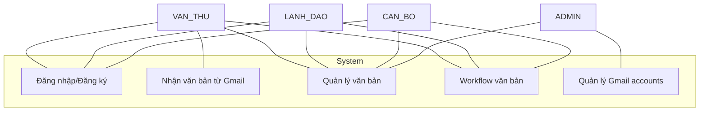
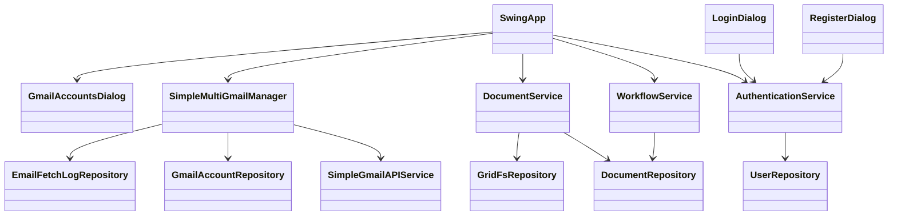
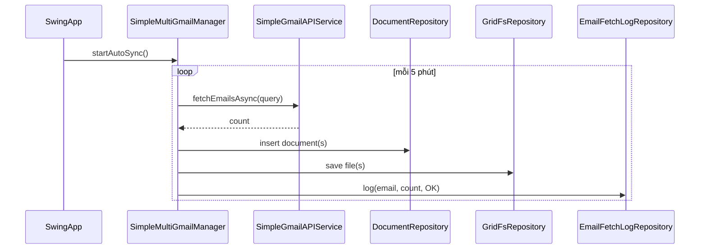

## UML (Mermaid)

### 1) Use Case Diagram

```mermaid
graph TB
  subgraph System
    UC1[Đăng nhập/Đăng ký]
    UC2[Nhận văn bản từ Gmail]
    UC3[Quản lý văn bản]
    UC4[Workflow văn bản]
    UC5[Quản lý Gmail accounts]
  end

  VAN_THU --- UC1
  VAN_THU --- UC2
  VAN_THU --- UC3
  VAN_THU --- UC4

  LANH_DAO --- UC1
  LANH_DAO --- UC3
  LANH_DAO --- UC4

  CAN_BO --- UC1
  CAN_BO --- UC3
  CAN_BO --- UC4

  ADMIN --- UC5
  ADMIN --- UC3
```

### 2) Class Diagram (rút gọn)

```mermaid
classDiagram
  class SwingApp
  class LoginDialog
  class RegisterDialog
  class GmailAccountsDialog
  class DocumentService
  class WorkflowService
  class AuthenticationService
  class SimpleMultiGmailManager
  class SimpleGmailAPIService
  class DocumentRepository
  class UserRepository
  class GridFsRepository
  class GmailAccountRepository
  class EmailFetchLogRepository

  SwingApp --> DocumentService
  SwingApp --> WorkflowService
  SwingApp --> AuthenticationService
  SwingApp --> SimpleMultiGmailManager
  SwingApp --> GmailAccountsDialog
  LoginDialog --> AuthenticationService
  RegisterDialog --> AuthenticationService
  SimpleMultiGmailManager --> SimpleGmailAPIService
  DocumentService --> DocumentRepository
  DocumentService --> GridFsRepository
  WorkflowService --> DocumentRepository
  AuthenticationService --> UserRepository
  SimpleMultiGmailManager --> GmailAccountRepository
  SimpleMultiGmailManager --> EmailFetchLogRepository
```

### 3) Sequence - Nhận Gmail tự động

```mermaid
sequenceDiagram
  participant GUI as SwingApp
  participant MGM as SimpleMultiGmailManager
  participant GSRV as SimpleGmailAPIService
  participant DR as DocumentRepository
  participant GR as GridFsRepository
  participant ELOG as EmailFetchLogRepository

  GUI->>MGM: startAutoSync()
  loop mỗi 5 phút
    MGM->>GSRV: fetchEmailsAsync(query)
    GSRV-->>MGM: count
    MGM->>DR: insert document(s)
    MGM->>GR: save file(s)
    MGM->>ELOG: log(email, count, OK)
  end
```

