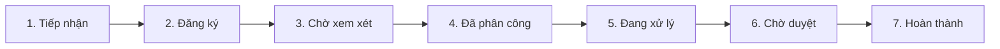

# Tổng quan Cơ sở dữ liệu - Ứng dụng Quản lý Văn bản

## 🏗️ Kiến trúc tổng quan

Ứng dụng sử dụng **kiến trúc hybrid** với 2 loại cơ sở dữ liệu:

- **PostgreSQL**: Lưu trữ metadata, thông tin văn bản, người dùng, quy trình
- **MongoDB GridFS**: Lưu trữ file đính kèm và tài liệu

## 📋 Các bảng chính (PostgreSQL)

### 1. Bảng Người dùng (users)
**Mục đích**: Quản lý tài khoản đăng nhập và phân quyền

| Trường | Mô tả | Ví dụ |
|--------|-------|-------|
| id | Mã số duy nhất | 1, 2, 3... |
| username | Tên đăng nhập | "admin", "vanthu01" |
| passwordHash | Mật khẩu đã mã hóa | "abc123..." |
| role | Vai trò trong hệ thống | VAN_THU, LANH_DAO, CAN_BO_CHUYEN_MON |

**3 vai trò chính**:
- **Văn thư**: Tiếp nhận và đăng ký văn bản
- **Lãnh đạo**: Xem xét, chỉ đạo và phê duyệt  
- **Cán bộ chuyên môn**: Thực hiện xử lý văn bản

### 2. Bảng Văn bản (documents)
**Mục đích**: Lưu trữ thông tin chính của văn bản

| Trường | Mô tả | Ví dụ |
|--------|-------|-------|
| id | Mã số văn bản | 1001, 1002... |
| title | Tiêu đề văn bản | "Công văn số 123/UBND" |
| docNumber | Số văn bản | 123 |
| docYear | Năm văn bản | 2024 |
| classification | Phân loại | "Công khai", "Mật" |
| securityLevel | Mức độ bảo mật | "Thường", "Mật" |
| priority | Mức độ ưu tiên | NORMAL, URGENT, EMERGENCY, FIRE |
| state | Trạng thái hiện tại | TIEP_NHAN, DANG_KY, CHO_XEM_XET... |
| assignedTo | Người được phân công | "Nguyễn Văn A" |
| deadline | Hạn xử lý | "2024-12-31" |
| createdAt | Thời gian tạo | "2024-01-15 09:00:00" |

### 3. Bảng Phiên bản văn bản (document_versions)
**Mục đích**: Theo dõi các phiên bản chỉnh sửa của văn bản

| Trường | Mô tả | Ví dụ |
|--------|-------|-------|
| id | Mã số phiên bản | 1, 2, 3... |
| documentId | Mã văn bản gốc | 1001 |
| fileId | Mã file trong MongoDB | "507f1f77bcf86cd799439011" |
| versionNo | Số phiên bản | 1, 2, 3... |
| createdAt | Thời gian tạo phiên bản | "2024-01-15 10:30:00" |

### 4. Bảng Nhật ký hoạt động (audit_logs)
**Mục đích**: Ghi lại mọi thao tác trên văn bản để đảm bảo tính minh bạch

| Trường | Mô tả | Ví dụ |
|--------|-------|-------|
| id | Mã số log | 1, 2, 3... |
| documentId | Mã văn bản | 1001 |
| action | Hành động thực hiện | "CREATE", "UPDATE", "ASSIGN" |
| actor | Người thực hiện | "admin", "vanthu01" |
| at | Thời gian thực hiện | "2024-01-15 09:15:00" |
| note | Ghi chú | "Phân công cho phòng Kế hoạch" |

## 📧 Hệ thống Email (Gmail)

### 5. Bảng Tài khoản Gmail (gmail_accounts)
**Mục đích**: Quản lý nhiều tài khoản email để nhận văn bản tự động

| Trường | Mô tả | Ví dụ |
|--------|-------|-------|
| id | Mã số tài khoản | 1, 2, 3... |
| email | Địa chỉ email | "vanban1@company.com" |
| refresh_token | Token làm mới | "1//04..." |
| access_token | Token truy cập | "ya29.a0..." |
| is_active | Trạng thái hoạt động | true/false |
| sync_interval_minutes | Tần suất kiểm tra (phút) | 5, 10, 15... |
| last_sync_at | Lần đồng bộ cuối | "2024-01-15 09:00:00" |

### 6. Bảng Email đã xử lý (processed_emails)
**Mục đích**: Tránh xử lý trùng lặp cùng một email

| Trường | Mô tả | Ví dụ |
|--------|-------|-------|
| id | Mã số | 1, 2, 3... |
| message_id | ID email từ Gmail | "<abc123@gmail.com>" |
| document_id | Mã văn bản được tạo | 1001 |
| processed_at | Thời gian xử lý | "2024-01-15 09:05:00" |

### 7. Bảng Lịch sử nhận email (email_fetch_logs)
**Mục đích**: Theo dõi quá trình nhận và xử lý email

| Trường | Mô tả | Ví dụ |
|--------|-------|-------|
| id | Mã số log | 1, 2, 3... |
| gmail_account_id | Mã tài khoản Gmail | 1 |
| fetch_started_at | Thời gian bắt đầu | "2024-01-15 09:00:00" |
| fetch_completed_at | Thời gian hoàn thành | "2024-01-15 09:05:00" |
| emails_processed | Số email xử lý | 5 |
| status | Trạng thái | "SUCCESS", "FAILED", "PARTIAL" |
| error_message | Thông báo lỗi | "Connection timeout" |

## 🔄 Quy trình văn bản (7 bước)

1. **Tiếp nhận** → Văn thư nhận văn bản từ email hoặc nguồn khác
2. **Đăng ký** → Văn thư đăng ký văn bản vào hệ thống
3. **Chờ xem xét** → Trình lãnh đạo xem xét
4. **Đã phân công** → Lãnh đạo chỉ đạo xử lý cho cán bộ
5. **Đang xử lý** → Cán bộ chuyên môn thực hiện nhiệm vụ
6. **Chờ duyệt** → Cán bộ đã xử lý, chờ lãnh đạo duyệt
7. **Hoàn thành** → Lãnh đạo đã duyệt xong, văn bản hoàn tất

## 📁 Lưu trữ file (MongoDB GridFS)

**Mục đích**: Lưu trữ file đính kèm và tài liệu văn bản

**Cách hoạt động**:
- File lớn được chia thành các chunk (phần nhỏ) để lưu trữ hiệu quả
- Mỗi file có metadata riêng (tên file, kích thước, loại file...)
- Hỗ trợ tìm kiếm và truy xuất nhanh chóng

**Cấu trúc**:
- **files collection**: Lưu metadata của file
- **chunks collection**: Lưu dữ liệu thực của file (chia nhỏ)

## 🎯 Tóm tắt hoạt động

### Luồng dữ liệu chính:
1. **Nhận email** → Hệ thống tự động kiểm tra Gmail
2. **Tạo văn bản** → Chuyển email thành văn bản trong hệ thống
3. **Phân công** → Lãnh đạo phân công cho cán bộ xử lý
4. **Xử lý** → Cán bộ thực hiện nhiệm vụ
5. **Duyệt** → Lãnh đạo duyệt kết quả
6. **Hoàn thành** → Văn bản được lưu trữ và theo dõi

### Lợi ích:
- **Tự động hóa**: Nhận văn bản từ email tự động
- **Minh bạch**: Mọi thao tác đều được ghi log
- **Phân quyền**: Mỗi vai trò có quyền hạn riêng
- **Lưu trữ an toàn**: File được lưu trữ phân tán
- **Truy xuất nhanh**: Tìm kiếm văn bản dễ dàng

## 🔧 Cấu hình kỹ thuật

- **Database Engine**: PostgreSQL 12+
- **File Storage**: MongoDB 4.4+ với GridFS
- **Connection Pool**: HikariCP
- **ORM**: JPA/Hibernate
- **Migration**: Flyway

---
*Tài liệu này được tạo tự động từ cấu trúc database của ứng dụng*
