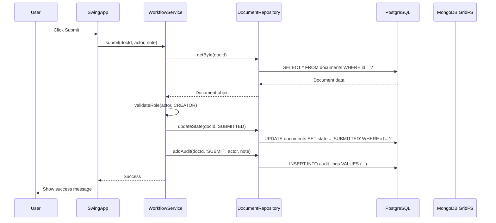
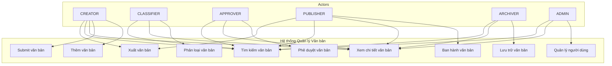
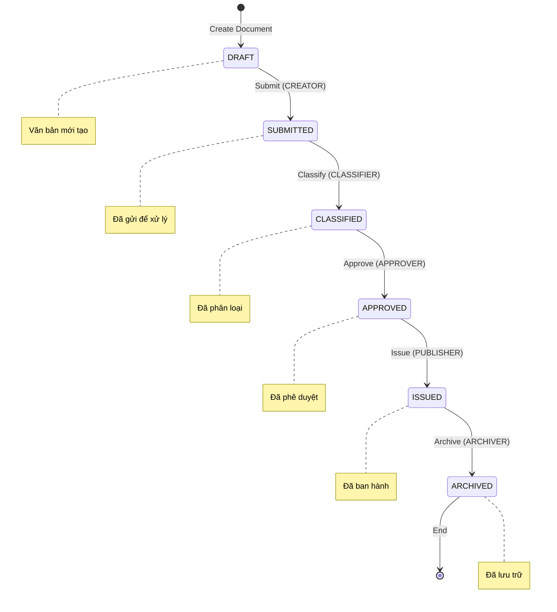
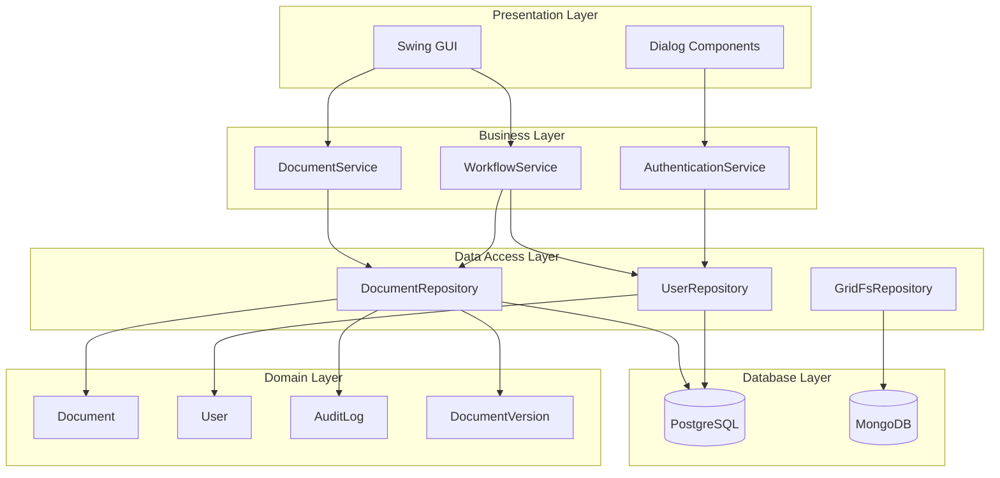
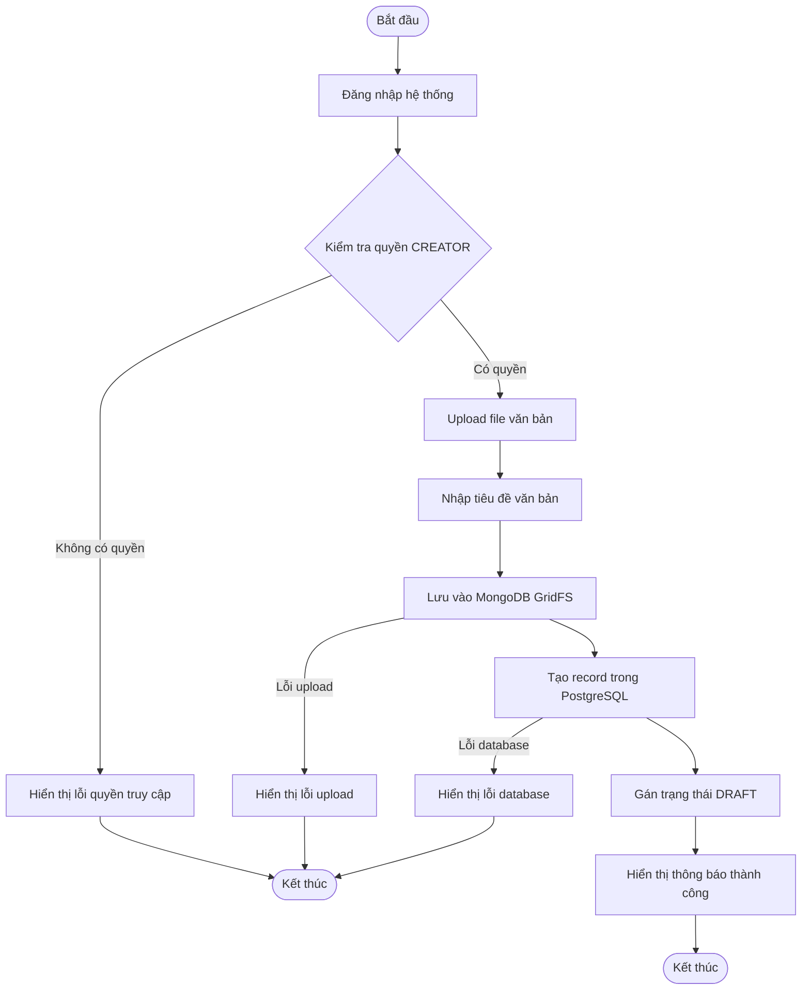
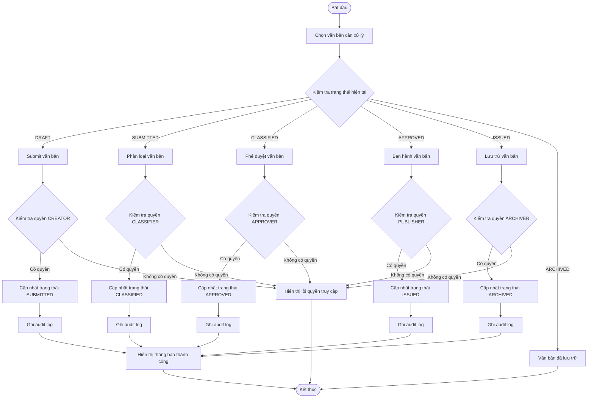
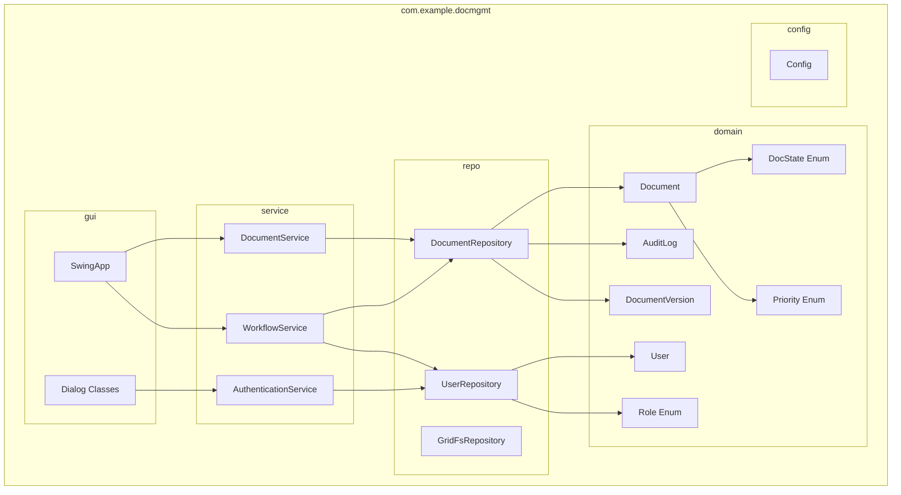
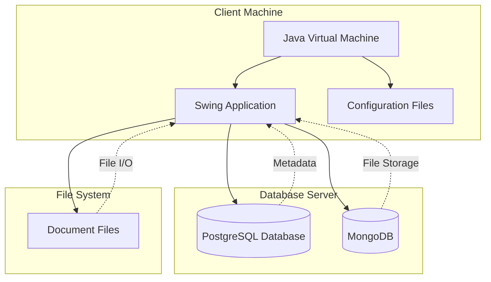

# UML Class Diagram - Hệ thống Quản lý Văn bản

## UML Class Diagram

```mermaid
classDiagram
    class User {
        -Long id
        -String username
        -String passwordHash
        -Role role
        -OffsetDateTime createdAt
        +User(Long, String, String, Role)
        +getId() Long
        +getUsername() String
        +getPasswordHash() String
        +getRole() Role
        +getCreatedAt() OffsetDateTime
    }
    
    class Document {
        -Long id
        -String title
        -OffsetDateTime createdAt
        -String latestFileId
        -DocState state
        -String classification
        -String securityLevel
        -Integer docNumber
        -Integer docYear
        -OffsetDateTime deadline
        -String assignedTo
        -String priority
        +Document(Long, String, OffsetDateTime, String, DocState, String, String, Integer, Integer, OffsetDateTime, String, String)
        +getId() Long
        +getTitle() String
        +getCreatedAt() OffsetDateTime
        +getLatestFileId() String
        +getState() DocState
        +getClassification() String
        +getSecurityLevel() String
        +getDocNumber() Integer
        +getDocYear() Integer
        +getDeadline() OffsetDateTime
        +getAssignedTo() String
        +getPriority() String
    }
    
    class DocumentVersion {
        -Long id
        -Long documentId
        -String fileId
        -Integer versionNo
        -OffsetDateTime createdAt
        +DocumentVersion(Long, Long, String, Integer, OffsetDateTime)
        +getId() Long
        +getDocumentId() Long
        +getFileId() String
        +getVersionNo() Integer
        +getCreatedAt() OffsetDateTime
    }
    
    class AuditLog {
        -Long id
        -Long documentId
        -String action
        -String actor
        -OffsetDateTime at
        -String note
        +AuditLog(Long, Long, String, String, OffsetDateTime, String)
        +getId() Long
        +getDocumentId() Long
        +getAction() String
        +getActor() String
        +getAt() OffsetDateTime
        +getNote() String
    }
    
    class GridFSFile {
        -ObjectId id
        -String filename
        -Long length
        -OffsetDateTime uploadDate
        -String contentType
        -byte[] data
        +GridFSFile(ObjectId, String, Long, OffsetDateTime, String, byte[])
        +getId() ObjectId
        +getFilename() String
        +getLength() Long
        +getUploadDate() OffsetDateTime
        +getContentType() String
        +getData() byte[]
    }
    
    class GridFSChunk {
        -ObjectId id
        -ObjectId filesId
        -Integer n
        -byte[] data
        +GridFSChunk(ObjectId, ObjectId, Integer, byte[])
        +getId() ObjectId
        +getFilesId() ObjectId
        +getN() Integer
        +getData() byte[]
    }
    
    class Role {
        <<enumeration>>
        CREATOR
        CLASSIFIER
        APPROVER
        PUBLISHER
        ARCHIVER
    }
    
    class DocState {
        <<enumeration>>
        DRAFT
        SUBMITTED
        CLASSIFIED
        APPROVED
        ISSUED
        ARCHIVED
    }
    
    class Priority {
        <<enumeration>>
        NORMAL
        URGENT
        EMERGENCY
        FIRE
    }
    
    %% Relationships
    Document ||--o{ DocumentVersion : "has versions"
    Document ||--o{ AuditLog : "has logs"
    Document }o--|| GridFSFile : "stores file"
    GridFSFile ||--o{ GridFSChunk : "has chunks"
    User ||--o{ AuditLog : "performs actions"
    User ||--|| Role : "has role"
    Document ||--|| DocState : "has state"
    Document ||--|| Priority : "has priority"
```

## Mô tả các Class theo UML

### 1. User Class
- **Thuộc tính private**: id, username, passwordHash, role, createdAt
- **Constructor**: User(Long, String, String, Role)
- **Methods**: Getter methods cho tất cả thuộc tính
- **Mối quan hệ**: 1-1 với Role, 1-n với AuditLog

### 2. Document Class
- **Thuộc tính private**: id, title, createdAt, latestFileId, state, classification, securityLevel, docNumber, docYear, deadline, assignedTo, priority
- **Constructor**: Document với 12 tham số
- **Methods**: Getter methods cho tất cả thuộc tính
- **Mối quan hệ**: 1-n với DocumentVersion, 1-n với AuditLog, 1-1 với GridFSFile

### 3. DocumentVersion Class
- **Thuộc tính private**: id, documentId, fileId, versionNo, createdAt
- **Constructor**: DocumentVersion(Long, Long, String, Integer, OffsetDateTime)
- **Methods**: Getter methods cho tất cả thuộc tính
- **Mối quan hệ**: n-1 với Document

### 4. AuditLog Class
- **Thuộc tính private**: id, documentId, action, actor, at, note
- **Constructor**: AuditLog(Long, Long, String, String, OffsetDateTime, String)
- **Methods**: Getter methods cho tất cả thuộc tính
- **Mối quan hệ**: n-1 với Document, n-1 với User

### 5. GridFSFile Class
- **Thuộc tính private**: id, filename, length, uploadDate, contentType, data
- **Constructor**: GridFSFile(ObjectId, String, Long, OffsetDateTime, String, byte[])
- **Methods**: Getter methods cho tất cả thuộc tính
- **Mối quan hệ**: 1-1 với Document, 1-n với GridFSChunk

### 6. GridFSChunk Class
- **Thuộc tính private**: id, filesId, n, data
- **Constructor**: GridFSChunk(ObjectId, ObjectId, Integer, byte[])
- **Methods**: Getter methods cho tất cả thuộc tính
- **Mối quan hệ**: n-1 với GridFSFile

### 7. Enumeration Classes
- **Role**: CREATOR, CLASSIFIER, APPROVER, PUBLISHER, ARCHIVER
- **DocState**: DRAFT, SUBMITTED, CLASSIFIED, APPROVED, ISSUED, ARCHIVED
- **Priority**: NORMAL, URGENT, EMERGENCY, FIRE

## Mối quan hệ

1. **DOCUMENTS → DOCUMENT_VERSIONS**: Một văn bản có nhiều phiên bản
2. **DOCUMENTS → AUDIT_LOGS**: Một văn bản có nhiều log thay đổi
3. **DOCUMENTS → GRIDFS_FILES**: Một văn bản có một file chính
4. **USERS → AUDIT_LOGS**: Một người dùng thực hiện nhiều hành động
5. **GRIDFS_FILES → GRIDFS_CHUNKS**: Một file có nhiều chunk

## UML Sequence Diagram - Document Workflow



## UML Use Case Diagram



## Workflow States - UML State Diagram



## User Roles & Permissions

| Role | Permissions |
|------|-------------|
| CREATOR | Tạo văn bản, Submit |
| CLASSIFIER | Phân loại văn bản |
| APPROVER | Phê duyệt văn bản |
| PUBLISHER | Ban hành văn bản |
| ARCHIVER | Lưu trữ văn bản |

## UML Component Diagram



## UML Activity Diagram - Document Creation Workflow



## UML Activity Diagram - Document Approval Workflow



## UML Package Diagram



## UML Deployment Diagram



## Database Schema Summary

- **PostgreSQL**: Metadata, relationships, audit logs
- **MongoDB GridFS**: File storage, versioning
- **Hybrid Architecture**: Best of both worlds
- **ACID Compliance**: PostgreSQL for data integrity
- **Scalable Storage**: MongoDB for large files
